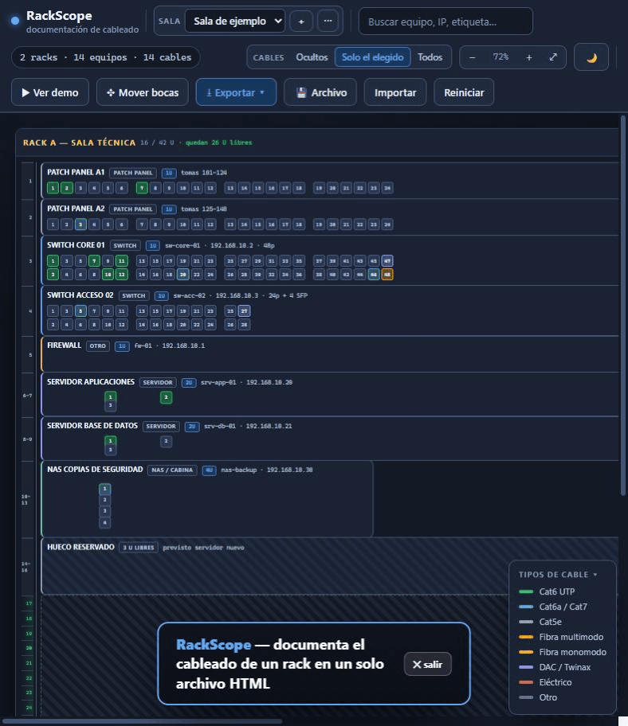

*[Español](README.md) · **English***

# RackScope

**Document your rack cabling in a single HTML file.** No server, no install, no dependencies — and nothing ever leaves your machine.

Which port goes to which port, with what cable and what notes. One `index.html` you open by double-clicking it in any browser.

It was born out of a very specific problem: with 24 and 48-port patch panels and a pile of tangled patch cords, finding where one cable ends means following it by eye or pulling on it and hoping. Here it takes one click.

🎬 **[Watch the demo video (30 s)](docs/demo.mp4)** · or hit **▶ Ver demo** inside the app to walk through it yourself.

## What it does

**Document the cabling**
- Click one port, click another: the cable is drawn between them.
- Every connection carries a cable type (Cat5e, Cat6, Cat6a/7, multimode fiber, single-mode fiber, DAC/Twinax, power), a short label and a free-form note.
- **Click any port and it tells you instantly where it goes**: device, exact port number, rack, cable type and your note. No tracing cables by eye.
- Hovering already pops up a quick hint with the destination.
- Used ports are painted in their cable's color, so free capacity is obvious at a glance.
- Cables can be hidden, shown only for the selected port, or all at once — so the screen never turns into spaghetti.

**Draw the rack as it actually is**
- Every device with its real port count, as a strip, a grid, or placed **by hand** wherever you want.
- Horizontal numbering (1…24) or vertical (1-2 / 3-4, like real switches), with gaps between blocks.
- Variable width and height: 1U bars, 2U servers, square arrays, several boxes side by side in one row.
- Tools to line ports up: multi-select with Ctrl/Shift, marquee selection, group drag, align, distribute, pack, sort by number and arrow-key nudging.

**Know what fits**
- A U ruler down the left of each rack, showing the range each device occupies.
- Free U are drawn and counted: *"18 / 42 U · 24 U free"*.
- **Blank panel** elements to reserve space exactly where it really is.

**Multiple rooms**
- A room selector: each one with its own racks, devices and cables, fully independent.

**Get the documentation out**
- **PNG** or **SVG** image of the whole layout.
- **PDF** with the layout, the connection table and a per-rack inventory with U usage.
- **CSV** for Excel with every connection.
- **JSON** backup.
- Any of them for one room or for all of them at once.

## How to use it

1. Download `index.html` and double-click it.
2. Hit **▶ Ver demo** for a 30-second guided tour.
3. It ships with a sample room to play with. When you want to start for real: **＋** in the room selector → *en blanco* (blank).
4. Hit **💾 Archivo** and pick a `.json` of your own: from then on the app rewrites it every time you change something.

## Where the data lives

On your machine and nowhere else. No server, no account, not a single network request. It is stored in the browser's local storage and, if you link a file, in that `.json` you chose.

One important caveat: browser storage is tied to the file's path. Move the HTML or download another copy into a different folder and that storage does not follow. So link a file, or export the JSON now and then. The app shows a red warning if it detects the browser will not let it save.

## Compatibility

Tested on Chromium-based browsers (Chrome and Edge). Automatic file saving uses the File System Access API; where that is unavailable, everything still works through JSON export and import.

Note: the interface is in Spanish.

## Status

A personal project, built to solve a real problem at work. Published in case it helps someone else. Suggestions welcome — open an issue describing what you would need.

## License

MIT. Do whatever you want with it.
