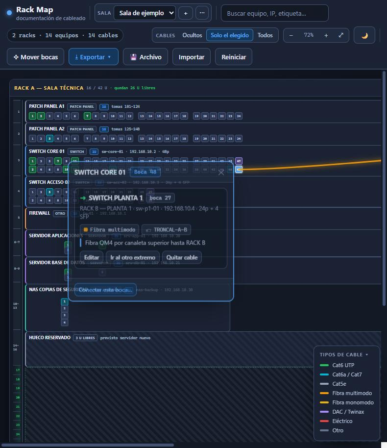

***Español** · [English](README.en.md)*

# RackScope

**Documenta el cableado de tus racks en un solo archivo HTML.** Sin servidor, sin instalación y sin que salga un dato de tu equipo.

Qué boca va a qué boca, con qué cable y con qué notas. Un único archivo `index.html` que se abre con doble clic en cualquier navegador.

Nació de un problema muy concreto: con paneles de 24 y 48 bocas y un montón de latiguillos mezclados, saber a dónde va un cable concreto obliga a seguirlo con la vista o a tirar de él. Aquí se resuelve con un clic.

> Pulsa **▶ Ver demo** dentro de la propia aplicación para ver esta visita guiada en tu navegador.

## Qué hace

**Documentar el cableado**
- Clic en una boca y clic en otra: queda el cable dibujado entre ambas.
- Cada conexión lleva tipo de cable (Cat5e, Cat6, Cat6a/7, fibra multimodo, fibra monomodo, DAC/Twinax, eléctrico), etiqueta corta y una nota libre.
- **Clic en cualquier boca y te dice al instante a dónde va**: equipo, número de boca exacto, rack, tipo de cable y la nota. Sin seguir el cable con la vista.
- Al pasar el ratón por encima ya sale un aviso rápido con el destino.
- Las bocas ocupadas se pintan del color del tipo de cable, así ves de un vistazo qué está libre.
- Los cables se pueden ocultar, ver solo el de la boca elegida o verlos todos, para que la pantalla no se convierta en una maraña.

**Dibujar el rack como es en realidad**
- Cada equipo con su número real de bocas, en tira, en rejilla o colocadas **a mano** donde te dé la gana.
- Numeración horizontal (1…24) o vertical (1-2 / 3-4, como los switches reales), con separación por bloques.
- Cajas de ancho y alto variable: barras de 1U, servidores de 2U, cabinas cuadradas, varias cajas en la misma fila.
- Herramientas para cuadrar bocas: selección múltiple con Ctrl/Shift, selección por recuadro, mover en grupo, alinear, repartir, juntar, ordenar por número y ajuste fino con las flechas.

**Saber qué te cabe**
- Regla de U a la izquierda de cada rack, con el rango que ocupa cada equipo.
- Las U libres se dibujan y se cuentan: *"18 / 42 U · quedan 24 U libres"*.
- Elementos de tipo **hueco libre** para reservar espacio donde de verdad está.

**Varias salas**
- Desplegable de salas: cada una con sus racks, equipos y cables, independientes.

**Sacar la documentación fuera**
- Imagen **PNG** o **SVG** del plano completo.
- **PDF** con el plano, la tabla de conexiones y el inventario por rack con sus U.
- **CSV** para Excel con todas las conexiones.
- **JSON** de copia de seguridad.
- Todo ello de una sala o de todas a la vez.

## Cómo se usa

1. Descarga `index.html` y ábrelo con doble clic. También puedes probarlo sin descargar nada desde la demo en línea.
2. Pulsa **▶ Ver demo** para una visita guiada de 30 segundos por las funciones.
3. Viene con una sala de ejemplo para trastear. Cuando quieras empezar en serio: **＋** en el desplegable de salas → *en blanco*.
4. Pulsa **💾 Archivo** y elige un `.json` tuyo: a partir de ahí la aplicación lo reescribe sola cada vez que cambias algo.

## Dónde se guardan los datos

En tu equipo y en ningún sitio más. No hay servidor, no hay cuenta y no sale una sola petición a Internet. Se guarda en el almacenamiento local del navegador y, si vinculas un archivo, en ese `.json` que eliges tú.

Un aviso importante: el almacenamiento del navegador va atado a la ruta del archivo. Si mueves el HTML o te descargas otra copia en otra carpeta, ese almacén no viaja contigo. Por eso conviene vincular un archivo o exportar el JSON de vez en cuando. La aplicación avisa en rojo si detecta que el navegador no le deja guardar.

## Compatibilidad

Probado en navegadores basados en Chromium (Chrome y Edge). El guardado automático en archivo usa la File System Access API; donde no esté disponible, funciona igual con exportar e importar JSON.

## Estado

Proyecto personal, hecho para resolver un problema real de trabajo. Se publica por si le sirve a alguien más. Las sugerencias son bienvenidas: abre un *issue* contando qué necesitarías.

## Licencia

MIT. Haz lo que quieras con él.
